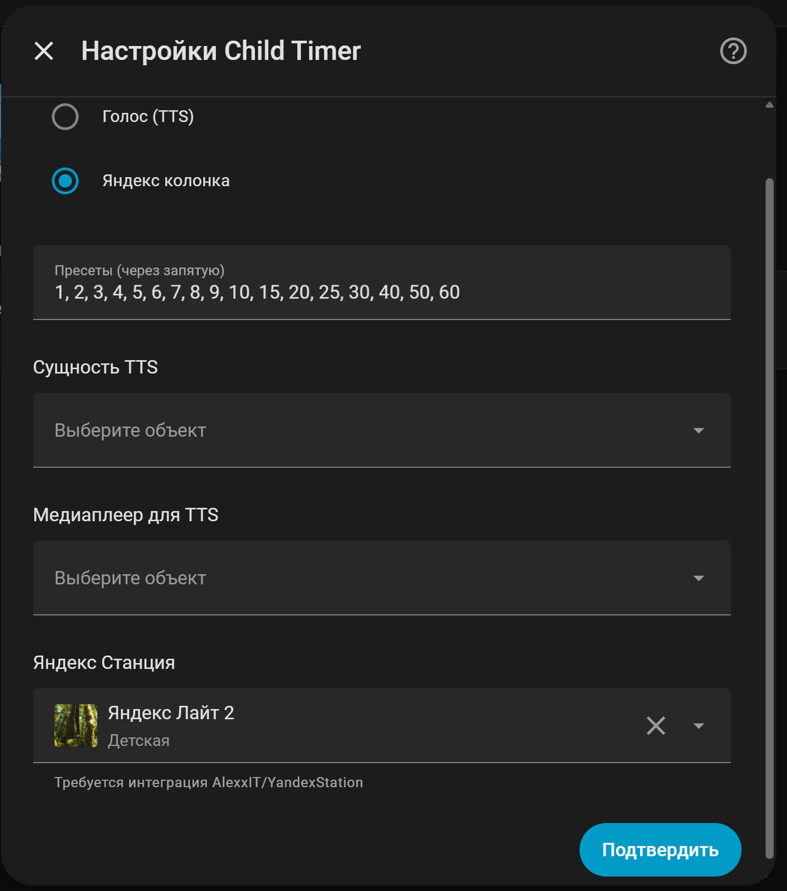
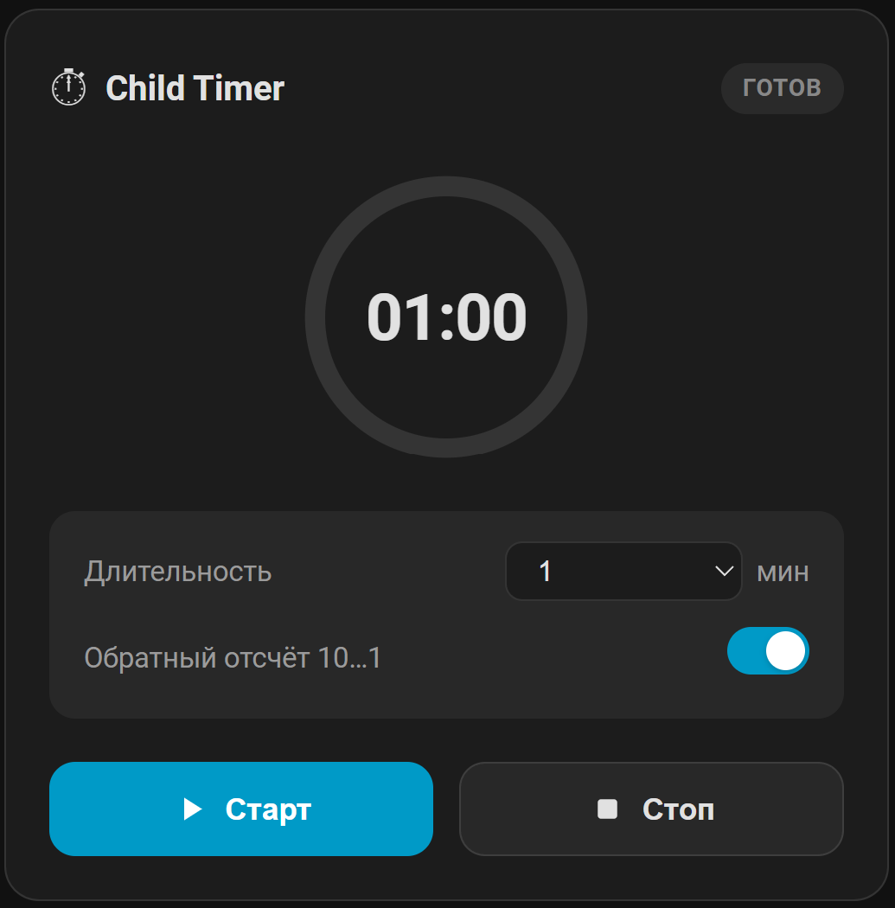
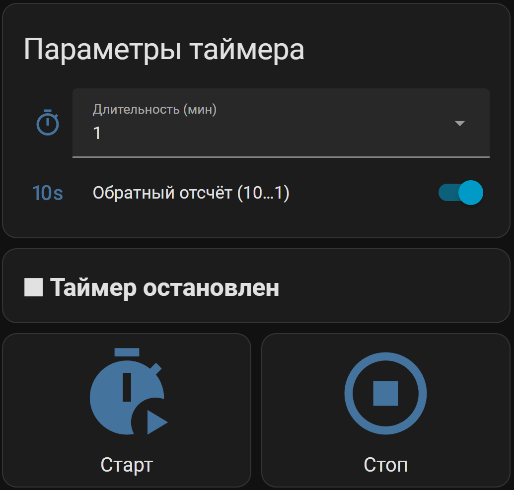

# Child Timer

[](https://hacs.xyz) [](https://github.com/mxvisor/ha-child-timer/releases)

**Language:** [English](README.md) | [Русский](README.ru.md)

Кастомная интеграция Home Assistant с голосовым таймером для детей. Распространяется через HACS как интеграция с одним экземпляром и собственной Lovelace-карточкой.

## Что вы получаете
- Config Flow: выбор канала озвучки — обычный TTS (любой `tts.*` + `media_player.*`) или Яндекс Станция (AlexxIT/YandexStation).
- Сущности:
  - `sensor.child_timer` — состояние `active`/`idle`.
    - атрибуты: `remaining_seconds` (int), `total_seconds` (int), `remaining_formatted` (str), `progress` (float 0.0..1.0).
  - `number.child_timer_duration` — слайдер 1-1440 минут, сохраняется между перезапусками, по умолчанию 5 минут.
  - `select.child_timer_preset` — список пресетов из мастера настройки (по умолчанию: 1-10, 15, 20, 25, 30, 40, 50, 60 минут).
  - `switch.child_timer_countdown` — включает озвучивание обратного отсчета 10..1 перед завершением (по умолчанию включен).
  - `switch.child_timer` — единый переключатель запуска/остановки: `turn_on` запускает таймер, `turn_off` останавливает.
- Сервисы: `child_timer.start` (опциональный `duration` в секундах, минимум 10) и `child_timer.stop`. Сервис позволяет запускать короткие таймеры от 10 секунд, даже если слайдер длительности начинается с 1 минуты — это сделано специально для автоматизаций.
- Lovelace-карточка `custom:child-timer-card` раздается самой интеграцией и пытается автоматически зарегистрировать ресурс.
- Частота голосовых уведомлений (для TTS/Яндекс):
  - Более 1 часа осталось: каждые 30 минут.
  - 60-15 минут: каждые 15 минут.
  - 15-5 минут: каждые 5 минут.
  - 5-1 минут: каждую минуту.
  - 60-15 секунд: каждые 15 секунд.
  - Опциональный обратный отсчет 10..1 отправляется только при включенном `switch.child_timer_countdown`.

## Установка (кастомный репозиторий HACS)

[](https://my.home-assistant.io/redirect/hacs_repository/?owner=MXVisoR&repository=ha-child-timer&category=integration)

1. В HACS откройте `Custom repositories` и добавьте `https://github.com/mxvisor/ha-child-timer` в категории **Integration**.
2. Установите **Child Timer**, при необходимости перезапустите Home Assistant.
3. `Настройки -> Устройства и службы -> Добавить интеграцию -> Child Timer`, завершите мастер.
4. Ресурс карточки регистрируется автоматически. Если автодобавление не сработало или ресурсы Lovelace ведутся вручную:
   - `Настройки -> Панели управления -> ⋮ -> Resources -> Add Resource`
   - URL: `/child_timer_static/child-timer-card.js`
   - Тип ресурса: **JavaScript module**

## Мастер настройки
- Выберите голосовой backend (TTS или Яндекс Станция). Обязательные поля зависят от выбранного режима.
- Укажите пресеты минут через запятую; они появятся в `select.child_timer_preset` и позже редактируются через Options.
- После завершения мастера все сущности создаются автоматически; таймер использует текущее значение `number.child_timer_duration`, если в сервисе не передан `duration` (в секундах).



## Lovelace-карточка
Если карточка не добавилась автоматически, добавьте вручную:

```yaml
type: custom:child-timer-card
preset_entity: select.child_timer_preset
countdown_entity: switch.child_timer_countdown
sensor_entity: sensor.child_timer
run_entity: switch.child_timer
title: Child Timer
```



Для быстрого старта можно использовать `examples/ha_child_timer_card.yaml` в вашем дашборде.


## Быстрые вызовы сервисов
- Запуск с кастомной длительностью (секунды): `service: child_timer.start` -> `data: { duration: 900 }` (15 минут).
- Досрочная остановка: `service: child_timer.stop`.

## Поддержка
- Issues и вопросы: https://github.com/mxvisor/ha-child-timer/issues
- Changelog/Releases: https://github.com/mxvisor/ha-child-timer/releases

## Благодарности
Сделано при поддержке [Claude AI](https://www.anthropic.com) (Anthropic).
